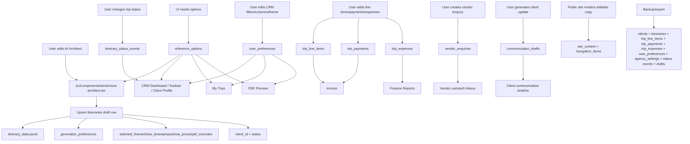

# Supabase Persistence Audit

Reviewed on `2026-04-12`

Scope reviewed:
- `157` source files under `src/**/*.ts`, `src/**/*.tsx`, `src/**/*.js`, `src/**/*.jsx`
- all Supabase migrations under `supabase/migrations`

Audit goal:
- zero hardcoded user-facing business data
- zero user-important state that only survives in memory/localStorage
- zero schema drift between the frontend and Supabase
- every user-specific value tied to `user_id`

Notes:
- I treated ordinary visual constants, styling values, and implementation-only literals as out of scope unless they affect user-editable content, user data persistence, workflow configuration, pricing, statuses, or cross-device continuity.
- Where several files repeat the same taxonomy or option list, I grouped them into one finding so the fix is clear and not duplicated 10 times.

## Findings

### 1. Critical persistence and schema gaps

**🔴 ISSUE TYPE: [Context Bypass / Local State]**  
**📁 FILE:** `src/components/sections/ai-architect.tsx`  
**📌 LINE(S):** `97-156`, `219-301`, `793-800`, `1848-1864`, `1976-1977`  
**🔍 WHAT IT IS:** The AI Architect keeps the core draft in local component state and `localStorage` keys like `travelItinerary`, `travelHotels`, `travelFlights`, `travelCabs`, `travelBuses`, `travelPricing`, `optimizationCount`, `draft_client_id`, `draft_status`, and `travelMetadata`. It also keeps `selectedTheme`, `showTimestamps`, `showPrices`, `selectedClientId`, `selectedStatus`, and `optimizationCount` outside the database.  
**⚠️ PROBLEM:** Drafts survive only in the current browser. A user switching devices/browsers loses the entire in-progress trip, PDF preferences, optimization count, and CRM linkage until a manual save happens. The hardcoded optimization cap `3` is also a business rule living only in UI code.  
**✅ FIX:** Persist the draft immediately in `public.itineraries` instead of `localStorage`. Reuse/create columns:
- `itineraries.user_id uuid`
- `itineraries.client_id uuid`
- `itineraries.status text`
- `itineraries.itinerary_data jsonb` for itinerary/hotels/flights/cabs/buses/pricing
- `itineraries.generation_preferences jsonb`
- `itineraries.selected_theme text`
- `itineraries.show_timestamps boolean`
- `itineraries.show_prices boolean`
- `itineraries.optimization_count integer`
- `itineraries.pdf_overrides jsonb`
- `itineraries.last_activity_at timestamptz`
- optional `itineraries.draft_source_itinerary_id uuid`

**🔴 ISSUE TYPE: [Context Bypass / No Global Presence]**  
**📁 FILE:** `src/contexts/itinerary-context.tsx`, `src/hooks/use-itinerary.ts`, `src/hooks/use-itinerary-pricing.ts`  
**📌 LINE(S):** `itinerary-context.tsx:11-25`, `115-160`; `use-itinerary.ts:1-104`; `use-itinerary-pricing.ts:1-27`  
**🔍 WHAT IT IS:** The itinerary editor store is a React context only. The provider seeds state from props and calculates dirty state locally, but nothing in the store auto-syncs back to Supabase.  
**⚠️ PROBLEM:** The store is global only within the mounted React tree, not globally persistent. A refresh, tab close, or device change wipes all unsaved edits.  
**✅ FIX:** Make the context a thin client over `itineraries`. On first edit, create/load the current draft row. Debounced updates should write `itinerary_data`, `selected_theme`, `show_timestamps`, `show_prices`, and `pdf_overrides` back to Supabase. Keep the context for UI responsiveness, but DB must be the source of truth.
-------------------done------------------------------
**🔴 ISSUE TYPE: [Local State / Lost On Refresh]**  
**📁 FILE:** `src/app/my-trips/page.tsx`, `src/app/crm/page.tsx`  
**📌 LINE(S):** `my-trips/page.tsx:184-194`; `crm/page.tsx:832-842`  
**🔍 WHAT IT IS:** “Duplicate trip” does not create a new DB record. It copies trip data into the AI Architect’s `localStorage` draft keys and redirects the user.  
**⚠️ PROBLEM:** The duplicate only exists in the current browser session. It is invisible to other tabs/devices and can disappear before the user ever saves it.  
**✅ FIX:** Replace the `localStorage` copy with a real `insert` into `public.itineraries` using `status='draft'`, copied `itinerary_data`, copied financial fields, and optional `draft_source_itinerary_id`.

**🔴 ISSUE TYPE: [Local State / Context Bypass]**  
**📁 FILE:** `src/app/crm/page.tsx`  
**📌 LINE(S):** `126`, `152-179`, `193-215`, `866-891`, `1006`, `1034`, `1542-1546`  
**🔍 WHAT IT IS:** CRM state such as `selectedTheme`, `sortColumn`, `sortDirection`, `currentPage`, `visibleColumns`, `dateFrom`, `dateTo`, `budgetMin`, `budgetMax`, `savedPresets`, `lastViewedActivity`, `deadlineRange`, and filter presets are kept only in React state or `localStorage`.  
**⚠️ PROBLEM:** The user’s CRM workspace is not portable. Column visibility, saved filters, recent activity state, and PDF preferences differ per browser and disappear on refresh/new device.  
**✅ FIX:** Create `public.user_preferences` with:
- `user_id uuid primary key references auth.users(id)`
- `crm_visible_columns jsonb`
- `crm_sort jsonb`
- `crm_filters jsonb`
- `crm_filter_presets jsonb`
- `crm_last_viewed_activity_at timestamptz`
- `crm_deadline_range integer`
- `default_pdf_theme text`
- `my_trips_preferences jsonb`
- `backup_prompt_dismissed boolean`
- `updated_at timestamptz`

**🔴 ISSUE TYPE: [No Global Presence / Missing DB Column]**  
**📁 FILE:** `src/app/crm/page.tsx`, `src/lib/crm-dashboard-metrics.ts`  
**📌 LINE(S):** `crm/page.tsx:214-215`, `568-576`, `900-910`; `crm-dashboard-metrics.ts:1-16`  
**🔍 WHAT IT IS:** `statusHistory` is built in-memory for the current session, while the analytics helper explicitly documents missing future schema for stage transitions and pipeline fields.  
**⚠️ PROBLEM:** Stage history is not durable, cannot be queried cross-session, and cannot power reliable funnel analytics, stage duration, or stale-deal reporting.  
**✅ FIX:** Create `public.itinerary_status_events`:
- `id uuid primary key`
- `user_id uuid not null references auth.users(id)`
- `itinerary_id uuid not null references itineraries(id) on delete cascade`
- `from_status text null`
- `to_status text not null`
- `changed_by uuid null references auth.users(id)`
- `notes text null`
- `changed_at timestamptz default now()`
- RLS on `user_id`

Also add to `itineraries`:
- `expected_value numeric`
- `loss_reason text`
- `last_activity_at timestamptz`

**🔴 ISSUE TYPE: [Missing DB Column / Orphaned Flow]**  
**📁 FILE:** `src/types/supabase.ts`, `src/contexts/auth-context.tsx`  
**📌 LINE(S):** `supabase.ts:1-235 (absence of definitions for agency_settings, trip_payments, trip_expenses and backup columns)`; `auth-context.tsx:11-24`  
**🔍 WHAT IT IS:** The generated TS schema is stale. It does not define `agency_settings`, `trip_payments`, `trip_expenses`, or the backup-related columns added to `user_profiles`. `AuthContext` also omits `google_refresh_token`, `google_drive_folder_id`, `backup_frequency`, and `last_backup_date`.  
**⚠️ PROBLEM:** The frontend is coding against a database shape it does not type-check. That allows silent runtime drift and makes fields appear “missing” from global state even though the DB already has them.  
**✅ FIX:** Regenerate `src/types/supabase.ts` from the current Supabase schema and extend the `UserProfile` interface to include:
- `google_refresh_token text | null`
- `google_drive_folder_id text | null`
- `backup_frequency text | null`
- `last_backup_date timestamptz | null`
///////////////////////////check later/////////////////////////////////
**🔴 ISSUE TYPE: [Orphaned Flow / Missing DB Column]**  
**📁 FILE:** `src/lib/backup-service.ts`  
**📌 LINE(S):** `14-22`, `35-42`, `203-216`, `271-273`  
**🔍 WHAT IT IS:** The backup service reads/writes a `trips` table that does not exist in migrations or generated types, and it treats `itineraries.trip_id` like a foreign key during restore even though migration `20260408000000_sync_financial_fields.sql` defines `trip_id` as `TEXT` human ID.  
**⚠️ PROBLEM:** Backups and restores are internally inconsistent. Cross-account restore can remap a text trip code as if it were a relation, and the `trips` payload path is effectively orphaned.  
**✅ FIX:** Remove `trips` from backup logic unless you create a real `public.trips` table. Treat `itineraries.trip_id` as a unique human-readable code only. Keep relational links on UUID columns such as `itinerary_id` and `client_id`.
///////////////////////////////////////////////////////////
**🔴 ISSUE TYPE: [Orphaned Flow / Lost On Restore]**  
**📁 FILE:** `src/lib/backup-service.ts`  
**📌 LINE(S):** `14-22`, `35-42`, `228-276`  
**🔍 WHAT IT IS:** Backup/restore includes `trip_line_items` but completely omits `trip_payments` and `trip_expenses`.  
**⚠️ PROBLEM:** Any Google Drive backup silently drops payment history and vendor expense history. A restore is therefore incomplete and can materially damage finance data.  
**✅ FIX:** Include `trip_payments` and `trip_expenses` in backup payload generation and restore mapping. Both tables should be keyed by `itinerary_id` and restored after `itineraries`.

**🔴 ISSUE TYPE: [Orphaned Flow / Hardcoded]**  
**📁 FILE:** `src/app/invoice/[id]/page.tsx`  
**📌 LINE(S):** `7-23`, `31-40`, `120-143`  
**🔍 WHAT IT IS:** The invoice page uses the Supabase service role for public rendering, reads only `itineraries`, `user_profiles`, and `trip_line_items`, and hardcodes `₹` for all totals.  
**⚠️ PROBLEM:** There are two problems:
- any guessable itinerary UUID can be queried without a share token or RLS-safe gate
- invoice totals ignore trip currency, payments received, agency bank details, and terms

This is both a security gap and a data-flow gap: data is written elsewhere (`trip_payments`, `agency_settings`) but never read back here.  
**✅ FIX:** Add to `itineraries`:
- `share_enabled boolean default false`
- `share_token uuid unique null`

Then render invoices through a secure server path using `share_token`. Also read:
- `itineraries.client_price`
- `trip_payments` for `amount_paid` / `balance_due`
- `agency_settings.bank_details`
- `agency_settings.terms_conditions`
- trip/agency currency instead of hardcoded `₹`

**🔴 ISSUE TYPE: [Orphaned Flow / Duplicate Source Of Truth]**  
**📁 FILE:** `src/components/sections/ai-architect.tsx`, `src/components/financial-tracker.tsx`  
**📌 LINE(S):** `ai-architect.tsx:573-590`; `financial-tracker.tsx:112-123`, `190-196`  
**🔍 WHAT IT IS:** Pricing is saved both inside `itinerary_data.pricing` and into promoted columns like `client_price`, `markup_value`, `markup_type`, `tax_percentage`, `commission_rate`, and `commission_amount`. The finance UI then partly reads from `itinerary_data.pricing` and partly from promoted columns.  
**⚠️ PROBLEM:** The same truth exists in two places and can drift. Currency is currently read from `itinerary_data.pricing.currency`, while quote totals come from promoted columns.  
**✅ FIX:** Keep one canonical rule:
- `itinerary_data` stores editor/draft detail
- promoted itinerary columns store normalized reporting fields

Every save must update both deterministically in one transaction-like path. Add `itineraries.updated_financial_at timestamptz` if needed for reconciliation, and stop reading currency from JSON when a normalized currency field exists.

### 2. Hardcoded taxonomies, defaults, and reference data

**🔴 ISSUE TYPE: [Hardcoded]**  
**📁 FILE:** `src/components/pricing-module.tsx`, `src/types/pricing.ts`, `src/components/crm-settings.tsx`, `src/components/finances-sheet.tsx`, `src/components/financial-tracker.tsx`, `src/types/financial.ts`  
**📌 LINE(S):** `pricing-module.tsx:21-34`, `61-66`, `84-97`; `types/pricing.ts:1-18`, `47-68`; `crm-settings.tsx:17-26`, `42-50`; `finances-sheet.tsx:23-28`, `36-42`, `167-170`; `financial-tracker.tsx:57`, `447-456`, `853-870`, `920-928`; `types/financial.ts:41-61`, `95-110`  
**🔍 WHAT IT IS:** Currencies, pricing tiers, default markups, default payment milestones, manual cost categories, payment methods, payment types, expense categories, and a legacy finance storage key are all defined in code.  
**⚠️ PROBLEM:** These are exactly the kinds of business options users usually need to edit per agency. Right now changes require code edits and redeploys, and some defaults are inconsistent:
- default currency `INR` in pricing
- default currency `USD` in agency settings and standalone bookings
- default markup `10` in `FinancesSheet`
- default markup `15` in `defaultPricingConfig`

**✅ FIX:** Create `public.reference_options` for DB-driven option sets:
- `id uuid primary key`
- `user_id uuid null references auth.users(id)`
- `scope text not null`
- `value text not null`
- `label text not null`
- `sort_order integer default 0`
- `is_active boolean default true`
- `metadata jsonb default '{}'::jsonb`
- `updated_at timestamptz default now()`

Use scopes such as:
- `currency`
- `pricing_tier`
- `manual_cost_category`
- `payment_method`
- `payment_type`
- `expense_category`
- `markup_type`

Keep default agency choices in `agency_settings`:
- `default_currency`
- `default_markup_type`
- `default_markup_value`
- `default_tax_percentage`
- `default_commission_rate`

**🔴 ISSUE TYPE: [Hardcoded]**  
**📁 FILE:** `src/components/hotel-flight-editor.tsx`, `src/components/vendor-enquiry.tsx`, `src/components/standalone-bookings/booking-dialog.tsx`, `src/types/standalone-bookings.ts`  
**📌 LINE(S):** `hotel-flight-editor.tsx:79-92`, `211-213`, `321-327`, `355-356`; `vendor-enquiry.tsx:23-29`, `71-99`, `248-307`; `booking-dialog.tsx:29-39`, `60-70`, `111-115`; `types/standalone-bookings.ts:1-2`  
**🔍 WHAT IT IS:** Service types, booking statuses, vendor enquiry types, meal plans, vehicle types, insurance coverage options, default passenger counts, default rooms, hotel check-in/check-out times, default cab/bus types, default booking currency, and booking status values are all hardcoded in components/types.  
**⚠️ PROBLEM:** This mixes agency policy, booking taxonomy, and vendor workflow configuration into UI files. It also creates mismatches:
- schema supports `bus` and `train` standalone bookings, but the UI create form only exposes `flight`, `cab`, and `hotel`
- booking status taxonomy (`draft`, `quoted`, `confirmed`, `cancelled`) diverges from itinerary taxonomy (`draft`, `proposed`, `sent`, `booked`, `rejected`, `completed`)

**✅ FIX:** Use `reference_options` scopes:
- `booking_service_type`
- `booking_status`
- `vendor_enquiry_type`
- `meal_plan`
- `vehicle_type`
- `insurance_coverage`

Add operational defaults to `agency_settings`:
- `default_booking_currency text`
- `default_hotel_check_in text`
- `default_hotel_check_out text`
- `default_hotel_star_rating integer`
- `default_cab_vehicle_type text`
- `default_bus_type text`
- `default_bus_reporting_time text`
- `default_bus_departure_time text`
- `default_meal_plan text`

**🔴 ISSUE TYPE: [Hardcoded / Inconsistent Taxonomy]**  
**📁 FILE:** `src/app/crm/page.tsx`, `src/app/crm/components/KanbanView.tsx`, `src/app/crm/components/DashboardView.tsx`, `src/app/crm/components/ClientsView.tsx`, `src/app/crm/components/CRMTableView.tsx`, `src/app/crm/components/ClientProfileSheet.tsx`, `src/app/crm/components/EditItineraryView.tsx`, `src/components/client-itinerary-editor.tsx`, `src/components/sections/ai-architect.tsx`  
**📌 LINE(S):** `crm/page.tsx:571-573`, `904-910`, `1296-1300`; `KanbanView.tsx:23-28`; `DashboardView.tsx:113-128`; `ClientsView.tsx:171-174`; `CRMTableView.tsx:116-119`; `ClientProfileSheet.tsx:193-197`; `EditItineraryView.tsx:71`; `client-itinerary-editor.tsx:53-54`, `137-140`; `ai-architect.tsx:1394-1397`, `1541-1544`  
**🔍 WHAT IT IS:** Workflow statuses are duplicated across multiple files. Some files use `confirmed`, some normalize it to `booked`, some include `proposed`, some do not, and dashboard analytics add `completed`.  
**⚠️ PROBLEM:** Pipeline math, filters, and UI badges are inconsistent because there is no single authoritative status taxonomy.  
**✅ FIX:** Use `reference_options(scope='itinerary_status')` for the option list and add `itinerary_status_events` for history. Every itinerary should store one canonical `status_key`, not a mixture of synonyms. Suggested initial rows:
- `draft`
- `proposed`
- `sent`
- `booked`
- `rejected`
- `completed`

Map old `confirmed` rows to `booked` in a migration.

**🔴 ISSUE TYPE: [Hardcoded / Missing DB Column]**  
**📁 FILE:** `src/components/pdf-template.tsx`, `src/components/pdf-preview-editor.tsx`, `src/app/my-trips/page.tsx`, `src/app/crm/page.tsx`, `src/app/crm/components/TimelineView.tsx`, `src/components/client-itinerary-editor.tsx`  
**📌 LINE(S):** `pdf-template.tsx:7`, `26-27`, `84`, `231`, `235`, `802`, `929-951`; `pdf-preview-editor.tsx:41-42`, `47-59`, `206-210`; `my-trips/page.tsx:58`, `349-353`; `crm/page.tsx:126`, `1542-1546`; `TimelineView.tsx:92-96`; `client-itinerary-editor.tsx:54`  
**🔍 WHAT IT IS:** PDF themes (`classic`, `editorial`, `minimalist`, `dark`, `corporate`), fallback branding (`Your Travel Architect`, `WanderLabs`, `Your Tailored Itinerary`, `Journey Dossier`), and selected theme state are hardcoded.  
**⚠️ PROBLEM:** Theme choices are not editable in data, not consistent across pages, and selected theme is not stored per itinerary/user.  
**✅ FIX:** Use:
- `reference_options(scope='pdf_theme')`
- `user_preferences.default_pdf_theme`
- `itineraries.selected_theme`
- `itineraries.pdf_overrides jsonb`

For fallback brand text, use `site_content` or `agency_settings`:
- `agency_settings.brand_name`
- `agency_settings.default_pdf_filename_template`

**🔴 ISSUE TYPE: [Hardcoded]**  
**📁 FILE:** `src/lib/token-tracker.ts`  
**📌 LINE(S):** `31-47`  
**🔍 WHAT IT IS:** AI model pricing is hardcoded in `TOKEN_PRICING`, and token usage is stored in `.token-usage.json`.  
**⚠️ PROBLEM:** Billing logic drifts when model rates change, and usage history is not durable, not user-scoped, and not queryable from Supabase.  
**✅ FIX:** Create:
- `public.ai_model_pricing(model text primary key, input_cost_per_token numeric, output_cost_per_token numeric, effective_from timestamptz, is_active boolean)`
- `public.ai_usage_events(id uuid, user_id uuid, flow_name text, model text, input_tokens int, output_tokens int, total_tokens int, estimated_cost_usd numeric, created_at timestamptz)`

Apply RLS on `ai_usage_events` by `user_id`.

**🔴 ISSUE TYPE: [Hardcoded / Missing DB Column]**  
**📁 FILE:** `src/types/financial.ts`  
**📌 LINE(S):** `84-101`, `104-110`  
**🔍 WHAT IT IS:** Human-readable trip IDs are generated client-side via random `GT-XXXX`, currency symbols are hardcoded, and legacy financial data still reads/writes `crm_financial_data` in `localStorage`.  
**⚠️ PROBLEM:** Random client-side trip IDs can collide and are not guaranteed unique or sequential. Legacy local storage bypasses the database and complicates restore/migration.  
**✅ FIX:** Generate `itineraries.trip_id` in the database via a sequence-backed function/trigger and add a unique index on `trip_id`. Remove `loadFinancialData` / `saveFinancialData` after migrating old records.

### 3. Local-only user inputs, drafts, and editor state

**🟠 ISSUE TYPE: [Local State]** 
**📁 FILE:** `src/components/pdf-preview-editor.tsx`  
**📌 LINE(S):** `47-59`, `67-75`, `201-210`, `359-387`  
**🔍 WHAT IT IS:** `theme`, `forcedBreaks`, `spacingOverrides`, `zoom`, and the edit panel state exist only in component state.  
**⚠️ PROBLEM:** A user can painstakingly fix page breaks, refresh the tab, and lose every override.  
**✅ FIX:** Persist per-trip document settings in `itineraries`:
- `selected_theme text`
- `pdf_overrides jsonb` with `{ forcedBreaksBefore: string[], spacingOverrides: Record<string, number> }`

If zoom is user preference rather than trip preference, store it in `user_preferences.pdf_preview_zoom`.

**🟠 ISSUE TYPE: [Local State]**  
**📁 FILE:** `src/components/vendor-enquiry.tsx`  
**📌 LINE(S):** `71-106`, `248-307`  
**🔍 WHAT IT IS:** Vendor enquiry form fields and generated email output (`generatedSubject`, `generatedBody`) are never persisted.  
**⚠️ PROBLEM:** Generated vendor outreach is lost on refresh and cannot be resumed from another device or audited later.  
**✅ FIX:** Create `public.vendor_enquiries`:
- `id uuid primary key`
- `user_id uuid not null references auth.users(id)`
- `client_id uuid null references clients(id)`
- `itinerary_id uuid null references itineraries(id)`
- `enquiry_type text not null`
- `vendor_email text`
- `payload jsonb not null`
- `subject text`
- `body text`
- `status text default 'draft'`
- `sent_at timestamptz null`
- `created_at/updated_at timestamptz`

**🟠 ISSUE TYPE: [Local State]**  
**📁 FILE:** `src/components/client-update-suggestions.tsx`  
**📌 LINE(S):** `68-78`, `102-142`, `223-250`  
**🔍 WHAT IT IS:** AI-generated client update suggestions, generated email drafts, and `customMessage` are only kept in memory.  
**⚠️ PROBLEM:** Users can generate communications and lose them immediately on refresh. There is also no message history or handoff across devices.  
**✅ FIX:** Create `public.communication_drafts`:
- `id uuid primary key`
- `user_id uuid not null references auth.users(id)`
- `client_id uuid null references clients(id)`
- `itinerary_id uuid null references itineraries(id)`
- `channel text not null default 'email'`
- `template_key text null`
- `subject text`
- `body text`
- `custom_message text`
- `status text default 'draft'`
- `sent_at timestamptz null`
- `created_at/updated_at timestamptz`

**🟠 ISSUE TYPE: [Local State]**  
**📁 FILE:** `src/components/client-itinerary-editor.tsx`  
**📌 LINE(S):** `52-55`, `61-67`, `132-141`  
**🔍 WHAT IT IS:** Editor `status` and `selectedTheme` live locally until save. Status is eventually persisted only when the user clicks save; theme is not.  
**⚠️ PROBLEM:** The quote editor can show a state that is different from the database. The selected PDF theme never survives across devices.  
**✅ FIX:** Persist:
- `itineraries.status`
- `itineraries.selected_theme`

Optionally autosave status/theme changes on change rather than on manual save.

**🟠 ISSUE TYPE: [Local State]**  
**📁 FILE:** `src/components/import-backup-modal.tsx`  
**📌 LINE(S):** `42-49`, `63-64`, `95-96`, `122`, `196`  
**🔍 WHAT IT IS:** `hasSeenBackupPrompt` and `importBackupIntent` are stored only in `localStorage`.  
**⚠️ PROBLEM:** The user sees different onboarding/import behavior per device/browser.  
**✅ FIX:** Store these in `user_preferences`:
- `backup_prompt_dismissed boolean`
- `pending_import_backup boolean`

**🟠 ISSUE TYPE: [Local State]**  
**📁 FILE:** `src/app/my-trips/page.tsx`, `src/app/crm/page.tsx`  
**📌 LINE(S):** `my-trips/page.tsx:58-59`, `349-353`; `crm/page.tsx:126`, `1542-1546`  
**🔍 WHAT IT IS:** Page-level PDF theme and “show favourites only” preferences are local React state only.  
**⚠️ PROBLEM:** These are user workspace preferences that reset every time the app remounts or the user switches browsers.  
**✅ FIX:** Store them in `user_preferences.my_trips_preferences` and `user_preferences.default_pdf_theme`.

**🟠 ISSUE TYPE: [Local State]**  
**📁 FILE:** `src/components/client-dialog.tsx`, `src/components/standalone-bookings/booking-dialog.tsx`, `src/components/crm-settings.tsx`, `src/app/profile/page.tsx`  
**📌 LINE(S):** `client-dialog.tsx:28-41`, `70-93`; `booking-dialog.tsx:29-39`, `53-70`; `crm-settings.tsx:34-50`, `77-99`; `profile/page.tsx:23-30`, `55-59`  
**🔍 WHAT IT IS:** These forms use local-only draft buffers. They are saved only when the user finishes and submits.  
**⚠️ PROBLEM:** Users lose mid-edit changes on refresh. This is lower severity than the AI Architect because a final save path exists, but it still violates the “never lose it” goal.  
**✅ FIX:** If you want literal cross-device continuity, add draft support:
- `client_drafts`
- `booking_drafts`
- `user_profile_drafts`

or autosave directly to the target row on change with optimistic UI.

### 4. Inconsistent or orphaned data flows

**⚪ ISSUE TYPE: [Orphaned Flow]**  
**📁 FILE:** `src/components/financial-tracker.tsx`, `src/types/financial.ts`  
**📌 LINE(S):** `financial-tracker.tsx:137-205`; `types/financial.ts:104-110`  
**🔍 WHAT IT IS:** The finance area still contains legacy migration logic from `crm_financial_data` in `localStorage`.  
**⚠️ PROBLEM:** This is a signal that finance data historically bypassed Supabase. Until the migration path is removed, backup/restore and type assumptions remain muddy.  
**✅ FIX:** Finish the one-time migration, verify all records are in `trip_payments`, `trip_expenses`, and normalized itinerary columns, then remove the local-storage helper functions entirely.

**⚪ ISSUE TYPE: [Orphaned Flow / Inconsistent Naming]**  
**📁 FILE:** `src/app/crm/page.tsx`, `src/app/crm/components/KanbanView.tsx`, `src/app/crm/components/DashboardView.tsx`, `src/components/client-itinerary-editor.tsx`, `src/components/sections/ai-architect.tsx`  
**📌 LINE(S):** `crm/page.tsx:571-573`, `904-910`, `1296-1300`; `KanbanView.tsx:23-28`; `DashboardView.tsx:113-128`; `client-itinerary-editor.tsx:137-140`; `ai-architect.tsx:1394-1397`, `1541-1544`  
**🔍 WHAT IT IS:** Some components persist `confirmed`, some translate it to `booked`, and some analytics count both.  
**⚠️ PROBLEM:** The UI can display one stage name while the DB stores another. Reports and filters become unreliable.  
**✅ FIX:** Migrate existing rows to one canonical status set and enforce status values from `reference_options(scope='itinerary_status')`.

**⚪ ISSUE TYPE: [Orphaned Flow / Inconsistent Currency]**  
**📁 FILE:** `src/components/finances-sheet.tsx`, `src/components/financial-tracker.tsx`, `src/components/standalone-bookings/booking-dialog.tsx`, `src/app/invoice/[id]/page.tsx`  
**📌 LINE(S):** `finances-sheet.tsx:23-28`, `36-42`; `financial-tracker.tsx:118`; `booking-dialog.tsx:65-70`; `invoice/[id]/page.tsx:129-143`  
**🔍 WHAT IT IS:** Finance-related screens do not agree on currency:
- `FinancesSheet` inserts line items with `currency: 'INR'`
- `FinancialTracker` falls back to `INR`
- standalone bookings default to `USD`
- invoice rendering hardcodes `₹`

**⚠️ PROBLEM:** Currency becomes silently wrong depending on entry point.  
**✅ FIX:** Normalize to one persisted source:
- `itineraries.currency text`
- `standalone_bookings.currency text`
- `agency_settings.default_currency text`

Every finance write should use trip/booking currency. Every read should format using that persisted value.

**⚪ ISSUE TYPE: [Orphaned Flow / Missing Readback]**  
**📁 FILE:** `src/app/invoice/[id]/page.tsx`, `src/components/settings/backup-settings.tsx`, `src/components/settings/backup-scheduler.tsx`  
**📌 LINE(S):** `invoice/[id]/page.tsx:31-40`, `120-150`; `backup-settings.tsx:15-16`, `50-55`; `backup-scheduler.tsx:7-16`, `30-34`  
**🔍 WHAT IT IS:** Some DB-backed values are written but not fully read or surfaced elsewhere:
- `trip_payments` are written but not used by invoice rendering
- `agency_settings.bank_details` / `terms_conditions` are written but not used by invoice rendering
- `user_profiles.backup_frequency` is written but the scheduler only acts in a mounted browser session

**⚠️ PROBLEM:** Data exists but does not fully drive the product. Users can enter information that never appears where they expect it.  
**✅ FIX:** Wire these DB values into invoice/share flows and move backup scheduling to a server-side job runner if automation is meant to be reliable.

### 5. Static marketing/demo content that would need CMS backing for literal zero hardcoded copy

**🔴 ISSUE TYPE: [Hardcoded]**  
**📁 FILE:** `src/app/page.tsx`, `src/components/sections/hero.tsx`, `src/components/sections/feature-steps-section.tsx`, `src/components/sections/packages.tsx`, `src/components/sections/curated-itineraries.tsx`, `src/components/sections/how-it-works-timeline.tsx`, `src/components/sections/animated-typography.tsx`, `src/components/sections/contact.tsx`  
**📌 LINE(S):** `page.tsx:11-92`; `hero.tsx:9-16`, `129-174`; `feature-steps-section.tsx:3-40`; `packages.tsx:9-35`; `curated-itineraries.tsx:5-30`; `how-it-works-timeline.tsx:9-30`; `animated-typography.tsx:7-16`; `contact.tsx:9-18`  
**🔍 WHAT IT IS:** Landing-page cards, sample itineraries, step copy, package names, testimonials, animated words, and the WhatsApp contact CTA are all hardcoded.  
**⚠️ PROBLEM:** If your requirement is literally “no user-facing data in code,” the public site is not CMS-backed. The WhatsApp contact link is especially risky because it is a real operational value in code.  
**✅ FIX:** Create:
- `public.site_content(id uuid, content_key text unique, content jsonb, is_public boolean, updated_at timestamptz)`
- `public.navigation_items(id uuid, location text, label text, href text, sort_order int, is_active boolean)`

Suggested `site_content.content_key` values:
- `home.parallax_products`
- `home.hero_demo_itineraries`
- `home.hero_stats`
- `home.feature_steps`
- `home.packages`
- `home.curated_pdf_themes`
- `home.how_it_works`
- `home.animated_words`
- `home.contact_cta`

For the WhatsApp number specifically, either store it in `site_content` or `agency_settings.contact_whatsapp_number`.

**🔴 ISSUE TYPE: [Hardcoded]**  
**📁 FILE:** `src/components/layout/header.tsx`, `src/components/layout/footer.tsx`, `src/components/layout/logo.tsx`, `src/app/layout.tsx`  
**📌 LINE(S):** `header.tsx:34-39`; `footer.tsx:8-20`; `logo.tsx:7-11`; `app/layout.tsx:10-13`  
**🔍 WHAT IT IS:** Navigation labels, legal links, brand name “Wander Labs,” and root metadata title/description are hardcoded.  
**⚠️ PROBLEM:** Brand and navigation cannot be changed without a redeploy.  
**✅ FIX:** Use `navigation_items` and `site_content`:
- `site_content['brand.name']`
- `site_content['brand.meta']`
- `navigation_items` for header/footer links

**🔴 ISSUE TYPE: [Hardcoded]**  
**📁 FILE:** `src/components/ui/clean-testimonial.tsx`, `src/components/ui/multistep-form.tsx`, `src/components/account-fab.tsx`  
**📌 LINE(S):** `clean-testimonial.tsx:8-30`; `multistep-form.tsx:17-20`; `account-fab.tsx:9-25`  
**🔍 WHAT IT IS:** Demo testimonials, demo form steps/placeholders, and account FAB actions are static arrays in components.  
**⚠️ PROBLEM:** If these components are production-facing, the content is locked in code and not editable.  
**✅ FIX:** Move demo/marketing content into `site_content`, or if they are internal-only demos, explicitly mark them as demo-only and keep them out of the production surface.

### 6. Lower-severity config hardcoding

**🟡 ISSUE TYPE: [Hardcoded]**  
**📁 FILE:** `src/lib/audit-logger.ts`, `src/app/security/page.tsx`  
**📌 LINE(S):** `audit-logger.ts:5-17`; `security/page.tsx:39-64`, `291-297`  
**🔍 WHAT IT IS:** Audit action types and labels are duplicated as hardcoded enums/maps.  
**⚠️ PROBLEM:** If you want customizable labels, localization, or admin-defined action categories, the current setup cannot support it.  
**✅ FIX:** Either keep this as an application constant intentionally, or move labels into `reference_options(scope='audit_action_type')`. The raw event rows in `audit_logs.action_type` can remain text.

## Master Table List

### Create

| Table | Purpose | Suggested Columns | Relationships | RLS |
|---|---|---|---|---|
| `reference_options` | All editable dropdowns/taxonomies | `id uuid pk`, `user_id uuid null`, `scope text`, `value text`, `label text`, `sort_order int`, `is_active bool`, `metadata jsonb`, `updated_at timestamptz` | `user_id -> auth.users.id` | Yes. Owner-managed rows; allow read on system rows where `user_id is null` |
| `user_preferences` | Cross-device page/view preferences | `user_id uuid pk`, `crm_visible_columns jsonb`, `crm_sort jsonb`, `crm_filters jsonb`, `crm_filter_presets jsonb`, `crm_last_viewed_activity_at timestamptz`, `crm_deadline_range int`, `my_trips_preferences jsonb`, `default_pdf_theme text`, `backup_prompt_dismissed bool`, `pending_import_backup bool`, `updated_at timestamptz` | `user_id -> auth.users.id` | Yes |
| `itinerary_status_events` | Durable status history + analytics | `id uuid pk`, `user_id uuid`, `itinerary_id uuid`, `from_status text`, `to_status text`, `changed_by uuid null`, `notes text`, `changed_at timestamptz` | `user_id -> auth.users.id`, `itinerary_id -> itineraries.id`, `changed_by -> auth.users.id` | Yes |
| `vendor_enquiries` | Persist vendor outreach drafts/sent emails | `id uuid pk`, `user_id uuid`, `client_id uuid null`, `itinerary_id uuid null`, `enquiry_type text`, `vendor_email text`, `payload jsonb`, `subject text`, `body text`, `status text`, `sent_at timestamptz`, `created_at`, `updated_at` | `user_id -> auth.users.id`, `client_id -> clients.id`, `itinerary_id -> itineraries.id` | Yes |
| `communication_drafts` | Persist AI-generated client communication | `id uuid pk`, `user_id uuid`, `client_id uuid null`, `itinerary_id uuid null`, `channel text`, `template_key text`, `subject text`, `body text`, `custom_message text`, `status text`, `sent_at timestamptz`, `created_at`, `updated_at` | `user_id -> auth.users.id`, `client_id -> clients.id`, `itinerary_id -> itineraries.id` | Yes |
| `site_content` | CMS-style editable site content | `id uuid pk`, `content_key text unique`, `content jsonb`, `is_public bool`, `updated_at timestamptz` | none, or optional `user_id` if multi-tenant marketing | Public read only for public keys; admin-only writes |
| `navigation_items` | Header/footer navigation data | `id uuid pk`, `location text`, `label text`, `href text`, `sort_order int`, `is_active bool` | optional `site_content` tenancy key | Same as `site_content` |
| `ai_model_pricing` | Editable model cost config | `model text pk`, `input_cost_per_token numeric`, `output_cost_per_token numeric`, `effective_from timestamptz`, `is_active bool` | none | Admin/service-only writes |
| `ai_usage_events` | Durable token usage logs | `id uuid pk`, `user_id uuid`, `flow_name text`, `model text`, `input_tokens int`, `output_tokens int`, `total_tokens int`, `estimated_cost_usd numeric`, `created_at timestamptz` | `user_id -> auth.users.id` | Yes |

### Alter Existing Tables

| Table | Add / Change | Why |
|---|---|---|
| `itineraries` | `generation_preferences jsonb default '{}'::jsonb` | Persist AI architect preference form fields not already normalized |
| `itineraries` | `selected_theme text` | Per-trip PDF theme |
| `itineraries` | `show_timestamps boolean default true` | PDF/timeline preference |
| `itineraries` | `show_prices boolean default true` | PDF/timeline preference |
| `itineraries` | `optimization_count integer default 0` | Persist optimization usage |
| `itineraries` | `pdf_overrides jsonb default '{}'::jsonb` | Forced breaks / spacing overrides |
| `itineraries` | `last_activity_at timestamptz` | CRM stale-deal logic |
| `itineraries` | `expected_value numeric` | Pipeline analytics |
| `itineraries` | `loss_reason text` | Win/loss analytics |
| `itineraries` | `share_enabled boolean default false` | Secure invoice sharing |
| `itineraries` | `share_token uuid unique null` | Secure public invoice URL |
| `itineraries` | unique index on `trip_id` + DB-side generator | Stop random client-side trip ID generation |
| `agency_settings` | `default_booking_currency text` | Avoid `USD`/`INR` drift |
| `agency_settings` | `default_commission_rate numeric` | Replace hardcoded finance defaults |
| `agency_settings` | `default_hotel_check_in text`, `default_hotel_check_out text`, `default_hotel_star_rating integer` | Remove editor defaults from code |
| `agency_settings` | `default_cab_vehicle_type text`, `default_bus_type text`, `default_bus_reporting_time text`, `default_bus_departure_time text`, `default_meal_plan text` | Remove vendor/logistics defaults from code |
| `agency_settings` | `contact_whatsapp_number text` | Remove hardcoded CTA contact number |
| `agency_settings` | `default_pdf_filename_template text`, `brand_name text` | Remove hardcoded PDF/brand fallbacks |
| `user_profiles` | keep existing backup fields, regenerate types | Frontend already depends on them |

### Existing Tables That Must Be Reflected In Types

These already exist in migrations but are missing from `src/types/supabase.ts`:
- `agency_settings`
- `trip_payments`
- `trip_expenses`
- backup-related `user_profiles` columns

## Data Flow Diagram

## Priority Order

1. Fix backup and schema drift immediately.  
Reason: `backup-service` currently misses `trip_payments` and `trip_expenses`, references a nonexistent `trips` table, and the generated types are stale. This is the highest actual data-loss risk.

2. Replace AI Architect and duplicate-trip `localStorage` flows with real draft rows.  
Reason: this is the single biggest source of “lost on refresh / lost on new device” user data.

3. Normalize status taxonomy and add `itinerary_status_events`.  
Reason: CRM filters, dashboards, kanban, and editors are already inconsistent (`confirmed` vs `booked`, `quoted` vs `proposed`).

4. Persist CRM/user preferences and PDF overrides.  
Reason: lower business severity than trip data, but it directly violates the “new device sees exactly what I left” goal.

5. Move vendor/client communications into Supabase.  
Reason: generated outreach is valuable workflow output and is currently disposable.

6. Move option lists into `reference_options`.  
Reason: this unlocks agency-specific editing without redeploys and removes duplicated hardcoded taxonomies.

7. Move marketing/site content into CMS tables only if you truly want literal zero hardcoded copy.  
Reason: this is a larger product/content decision, but your current codebase is not CMS-backed.

## Recommended first migration batch

If you want the fastest path to stop data loss, do this first:

1. Regenerate `src/types/supabase.ts` and fix `AuthContext.UserProfile`.
2. Patch `BackupService` to:
- remove `trips`
- include `trip_payments`
- include `trip_expenses`
- stop remapping `itineraries.trip_id` as a foreign key
3. Add `user_preferences`.
4. Add the new `itineraries` columns: `generation_preferences`, `selected_theme`, `show_timestamps`, `show_prices`, `optimization_count`, `pdf_overrides`, `share_enabled`, `share_token`.
5. Change AI Architect and duplicate-trip flows to create/update draft itinerary rows instead of `localStorage`.
6. Add `itinerary_status_events`.
7. Introduce `reference_options` and migrate statuses/currencies/payment types first.

## Coverage Notes

All source files were reviewed. Files not explicitly named above did not contain a material Supabase persistence issue beyond one of these:
- ordinary presentational copy
- styling-only constants
- pure utility logic without user data ownership
- ephemeral UI state that does not represent user-authored or user-configured data

The highest-value fixes are concentrated in:
- `src/components/sections/ai-architect.tsx`
- `src/app/crm/page.tsx`
- `src/lib/backup-service.ts`
- `src/types/supabase.ts`
- `src/components/financial-tracker.tsx`
- `src/components/pdf-preview-editor.tsx`
- `src/components/vendor-enquiry.tsx`
- `src/components/client-update-suggestions.tsx`
